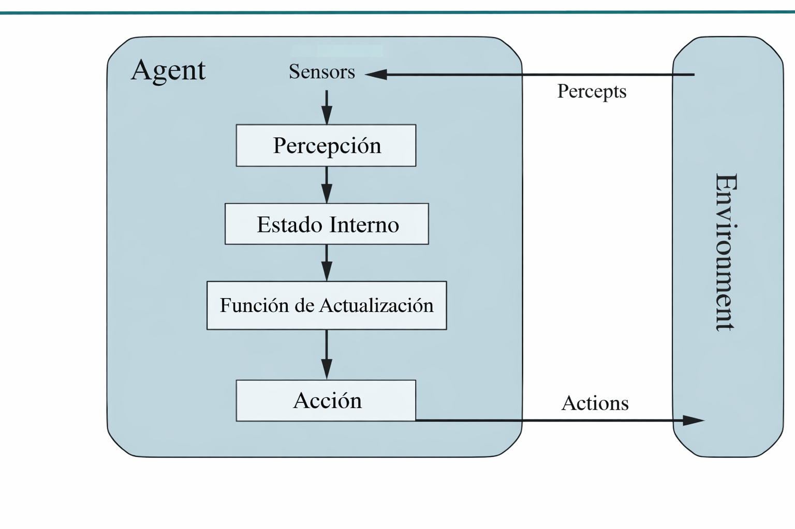

### Piedra – Papel – Tijera – Lagarto – Spock
## Axente Reactivo con Aprendizaxe por Frecuencias
## Autor: Adrián Rodríguez Sebastián
## Curso: MIA
## Profesor: @dfleta

## 1. Especificación do contorna de tarefas

| Contorno | Observable | Agentes | Determinista | Episódico | Estático | Discreto | Coñecido |
|----------|------------|---------|--------------|-----------|---------|----------|----------|
| RPS      | Parcialmente observable | 2 | Parcialmente determinista | Episódico | Estático | Discreto | Conocido |
| RPSLS   | Parcialmente observable | 2 | Parcialmente determinista | Secuencial | Estático | Discreto | Conocido |

**Justificación:**

- **Observable:** Cada jugador solo ve la jugada del otro después de realizar la suya.  
- **Agentes:** Dos agentes: jugador y máquina.  
- **Determinista:** Las reglas son fijas, pero la IA introduce variabilidad.  
- **Episódico/Secuencial:** Cada jugada es un episodio; si la IA aprende, es secuencial.  
- **Estático:** El entorno no cambia por sí solo durante el juego.  
- **Discreto:** Conjunto finito de acciones posibles (3 o 5 según versión).  
- **Conocido:** Reglas conocidas para ambos jugadores.

## 2. Identificación do tipo de axente

El agente que implementamos es **reactivo basado en modelo**.  
Recuerda el historial de jugadas del jugador para predecir la próxima acción y maximizar sus posibilidades de ganar.

### Diagrama del agente

### Explicación de los componentes

- **Percepción:** recibe la jugada del jugador en la ronda actual.  
- **Estado interno:** almacena el historial de jugadas para predecir patrones.  
- **Función de actualización:** decide la mejor jugada según el historial y la estrategia elegida.  
- **Actuador / Acción:** devuelve la jugada seleccionada por la IA.

## 4. Extensión a RPS + Lagarto + Spock

Hemos ampliado el juego clásico Piedra-Papel-Tijera (RPS) a la versión con cinco símbolos:

**Acciones adicionales:**  
- Lagarto  
- Spock

**Reglas de victoria:**

- Piedra aplasta a Tijera y aplasta a Lagarto  
- Papel cubre Piedra y refuta Spock  
- Tijera corta Papel y decapita Lagarto  
- Lagarto envenena Spock y devora Papel  
- Spock rompe Tijera y vaporiza Piedra

### Adaptación de la IA

La IA utiliza la **estrategia de aprendizaje por frecuencias**:

1. Mantiene un **historial de las jugadas del jugador**.  
2. Calcula cuál es la **acción más frecuente del jugador**.  
3. Elige **aleatoriamente entre las acciones que ganan** contra la más frecuente.  
4. Esto permite que la IA se **adapte y mejore su rendimiento** conforme avanza la partida.  

Esta estrategia es modular y permite **agregar fácilmente nuevas acciones o reglas** en el futuro, cumpliendo el principio OCP de SOLID.

